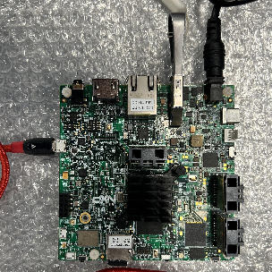

---
# User change
title: "Verify firmware with SystemRead ACS test"

weight: 4 # 1 is first, 2 is second, etc.

# Do not modify these elements
layout: "learningpathall"
---
In this section you will learn how to ....

## Preparation SystemReady ACS band image
We can directly download the SystemReady ACS band image from the [link](https://github.com/ARM-software/arm-systemready/tree/main/SystemReady-devicetree-band/prebuilt_images/). Or we can download it with command:

```console
wget https://github.com/ARM-software/arm-systemready/releases/download/v24.11_SR_REL3.0.0-BETA0_SR-DT_REL3.0.0-BETA0/systemready-dt_acs_live_image.wic.xz.zip
```

Then, we need to decompress the image and flash it into a USB stick.

```console
# Decompress the SystemReady ACS image
unzip systemready-dt_acs_live_image.wic.xz.zip; unxz systemready-dt_acs_live_image.wic.xz
```

```console
# Copy image into USB stick (replace sdX with the device on your local environment)
sudo dd if=systemready-dt_acs_live_image.wic of=/dev/sdX status=progress
sudo sync
```

Install the USB stick on the board, now it is ready for kicking off test.


## SystemRead ACS test

### U-Boot test
When U-Boot booting, we need input any key to interrupt auto boot flow and run into the U-Boot shell.  Then we can execute U-Boot commands one by one.

```console
U-Boot 2022.04-lf_v2022.04+g7376547b9e (Mar 01 2023 - 07:35:40 +0000)
                                                                      
CPU:   i.MX8MQ rev2.1 1500 MHz (running at 1000 MHz)                
CPU:   Commercial temperature grade (0C to 95C) at 24C              
Reset cause: POR                                                    
Model: NXP i.MX8MQ EVK                                              
DRAM:  3 GiB                                                        
TCPC:  Vendor ID [0x1fc9], Product ID [0x5110], Addr [I2C0 0x50]    
Core:  78 devices, 26 uclasses, devicetree: separate                
MMC:   FSL_SDHC: 0, FSL_SDHC: 1                                     
Loading Environment from MMC... OK                                  
[*]-Video Link 0 (1280 x 720)                                       
        [0] display-controller@32e00000, video                      
        [1] hdmi@32c00000, display                                  
In:    serial                                                       
Out:   serial                                                       
Err:   serial                                                       
SEC0:  RNG instantiated                                             
                                                                      
 BuildInfo:                                                         
  - ATF 616a458                                                     
                                                                      
switch to partitions #0, OK                                         
mmc0(part 0) is current device                                      
flash target is MMC:0                                               
Net:   eth0: ethernet@30be0000                                      
Fastboot: Normal                                                    
Normal Boot                                                         
Hit any key to stop autoboot:  0                                    
u-boot=>                                                            
u-boot=>                                                            
u-boot=> help
```

### UEFI test
The UEFI test requires the UEFI shell.  We can wait for GRUB to boot the entry bbr/bsa  and then press ESC  to run into UEFI shell.

```console
UEFI Interactive Shell v2.2                                                                
EDK II                                                                                     
UEFI v2.90 (Das U-Boot, 0x20220400)                                                        
Mapping table                                                                              
      FS0: Alias(s):HD0c:;BLK2:                                                            
          /VenHw(e61d73b9-a384-4acc-aeab-82e828f3628b)/eMMC(0)/eMMC(0)/HD(2,GPT,727b9634-7d)
      FS1: Alias(s):HD0b:;BLK4:                                                            
          /VenHw(e61d73b9-a384-4acc-aeab-82e828f3628b)/SD(1)/SD(1)/HD(1,GPT,c6f3f844-de33-4)
      FS2: Alias(s):HD0b:;BLK6:                                                            
          /VenHw(e61d73b9-a384-4acc-aeab-82e828f3628b)/UsbClass(0x0,0x0,0x9,0x0,0x3)/UsbCla)
      FS3: Alias(s):HD0c:;BLK7:                                                            
          /VenHw(e61d73b9-a384-4acc-aeab-82e828f3628b)/UsbClass(0x0,0x0,0x9,0x0,0x3)/UsbCla)
     BLK0: Alias(s):                                                                       
          /VenHw(e61d73b9-a384-4acc-aeab-82e828f3628b)/eMMC(0)/eMMC(0)                     
     BLK1: Alias(s):                                                                       
          /VenHw(e61d73b9-a384-4acc-aeab-82e828f3628b)/eMMC(0)/eMMC(0)/HD(1,GPT,4b4f886a-81)
     BLK3: Alias(s):                                                                       
          /VenHw(e61d73b9-a384-4acc-aeab-82e828f3628b)/SD(1)/SD(1)                         
     BLK5: Alias(s):                                                                       
          /VenHw(e61d73b9-a384-4acc-aeab-82e828f3628b)/UsbClass(0x0,0x0,0x9,0x0,0x3)/UsbCla)
No SimpleTextInputEx was found. CTRL-based features are not usable.                        
No SimpleTextInputEx was found. CTRL-based features are not usable.                        
                                                                                             
Press ESC in 4 seconds to skip startup.nsh or any other key to continue.                   
Shell>
```
