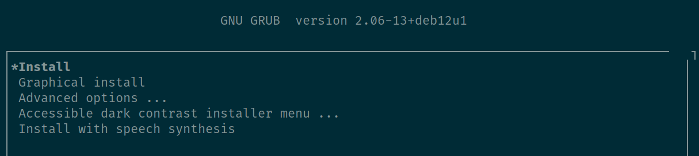
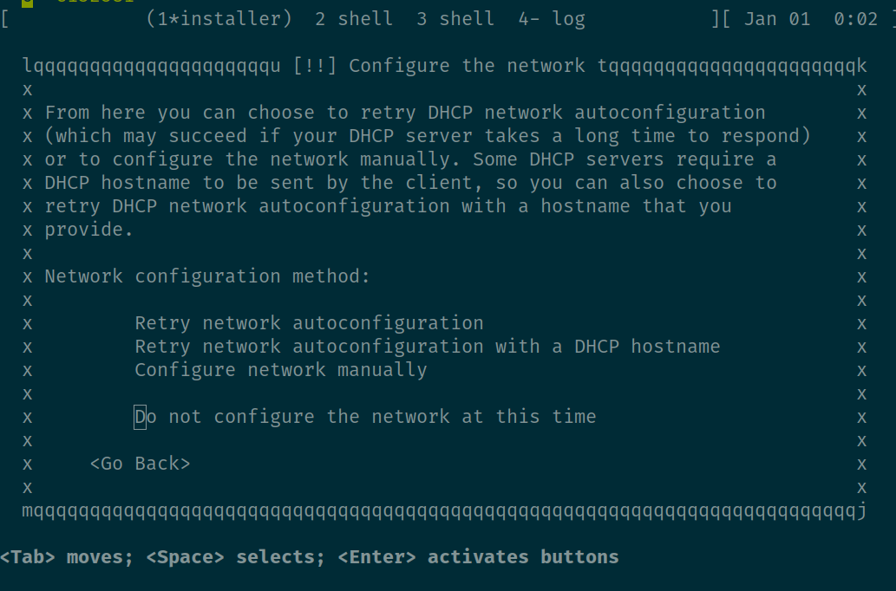
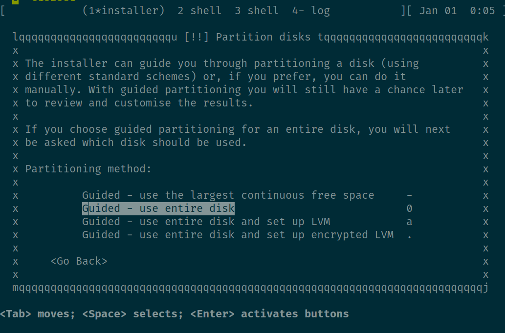
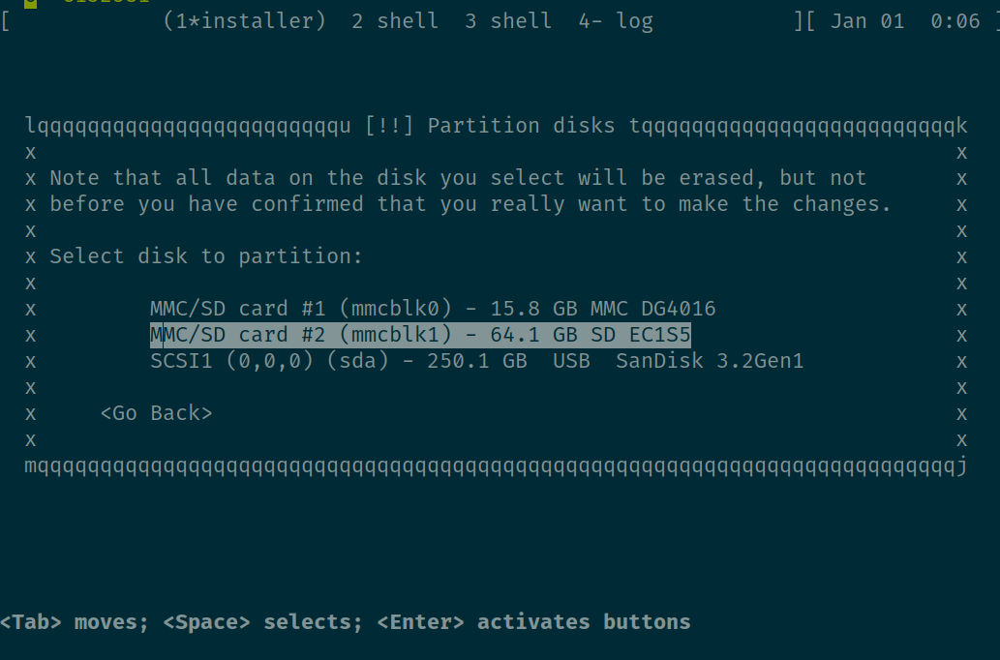

---
# User change
title: "Install different Linux Distro with certified board off-the-shelf"

weight: 5 # 1 is first, 2 is second, etc.

# Do not modify these elements
layout: "learningpathall"
---
In this section you will see ....


## Distro Installation
The experiment is for installation Debian distro.  
Below steps are for the installer image in a USB stick and the distro to be installed on a SD card.

### Preparation 
Downloading Debian Stable ISO image

```console
wget https://cdimage.debian.org/debian-cd/current/arm64/iso-cd/debian-12.9.0-arm64-netinst.iso
```

Flashing Debian ISO image onto USB stick

```console
sudo dd if=debian-12.8.0-arm64-DVD-1.iso of=/dev/sdX status=progress
3989385728 bytes (4.0 GB, 3.7 GiB) copied, 265 s, 15.1 MB/s
7799384+0 records in
7799384+0 records out
3993284608 bytes (4.0 GB, 3.7 GiB) copied, 279.232 s, 14.3 MB/s
sudo sync
```

### Installation Debian
Insert the USB stick and SD card properly before installation.  Power on the board, the U-Boot will load GRUB menu:


Select the Install entry.

To simplify the installation, I selected not to enable the network.



For the partitioning method, Guided - use entire disk is choosed.


Then, select the SD card for the partition.



Select the default options.  The installer will automatically create root, home and swap partitions on the SD card.



Install GRUB boot loader on SD card.

