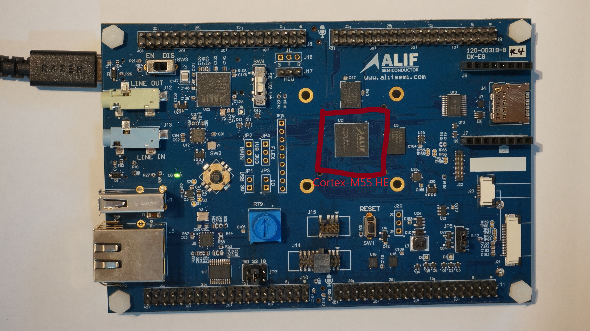
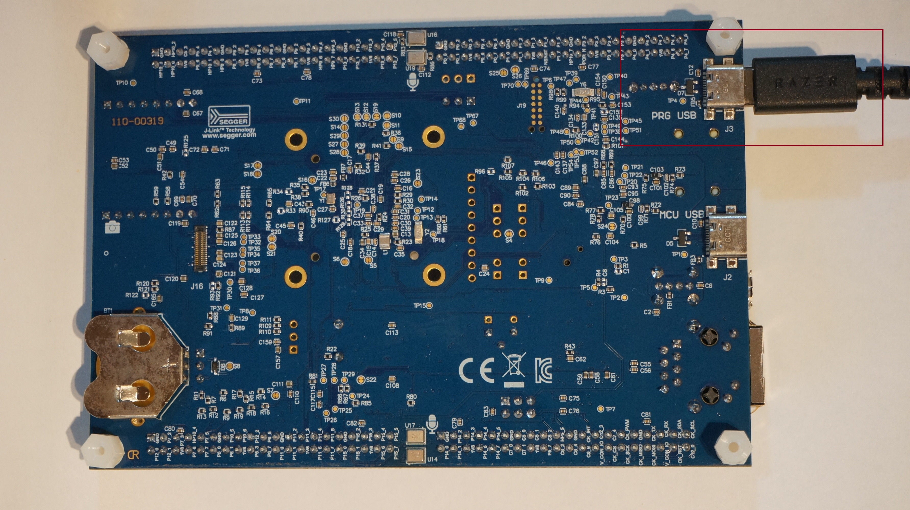
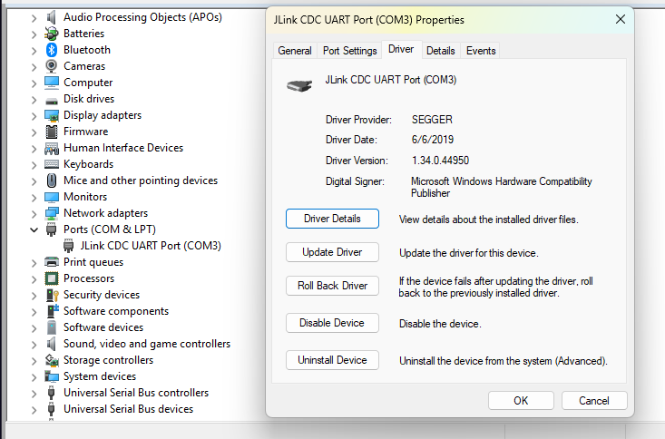

## Hardware setup

Before installing FWAuto, prepare the [Alif E8 DevKit](https://alifsemi.com/support/kits/ensemble-e8devkit/) hardware.

The Alif E8 DevKit features an [Arm Cortex-M55](https://developer.arm.com/Processors/Cortex-M55) microcontroller with integrated MRAM and SRAM. The board exposes a PRG USB port for programming and debugging, and an EN/DIS switch for power control.



1. Connect a USB cable from your computer to the port labeled **PRG USB** on the Alif E8 DevKit. This port provides both J-Link debug and a virtual COM port.



2. Locate the **EN/DIS switch** on the board. Set it to **EN**.

   Leave this switch in the EN position at all times. The flashing process enters SE maintenance mode automatically through software -- you never change this switch.

3. Verify the board is detected:


  
ls /dev/cu.usbmodem*
  

  
ls /dev/ttyACM*
  

  
Get-CimInstance Win32_SerialPort | Select-Object DeviceID,Name,Description
  


You should see a SEGGER J-Link device. On Linux you should see a device such as `/dev/ttyACM0`. On macOS you should see a device such as `/dev/cu.usbmodem1101`.



{}
Close any terminal application connected to the board, such as PuTTY, minicom, or screen, before you use FWAuto. The DevKit exposes only one SEUART interface, so the deploy script can't access the port if another application is already using it.
{}

## Understanding FWAuto

In the next sections you install [FWAuto](https://fwauto.ai/) and use it to build and flash firmware with the `/build` and `/deploy` commands. This section explains what FWAuto does so you understand what happens behind those commands.

### What FWAuto does

FWAuto is an AI-assisted firmware development tool. It provides a chat interface that can run shell commands, read files, and manage the build-flash-test workflow. You interact with it through natural language or slash commands.

In this Learning Path you use FWAuto for two tasks:

| Command | What it does |
|---------|--------------|
| `/build` | Runs the [CMake](https://cmake.org/) build to compile firmware for the [Cortex-M55](https://developer.arm.com/Processors/Cortex-M55) HE core |
| `/deploy` | Runs the deploy script to flash firmware to the Alif E8 board via SETOOLS |

You can also use `/log` to analyze UART output and `/help` to see all available commands.

### What makes FWAuto different

Unlike a general code assistant that only sees individual files, FWAuto understands the whole firmware project and automates the full loop:

| Capability | What it means |
|------------|---------------|
| Context awareness | Reads the SoC datasheet, SDK API, BSP, Device Tree, RTOS, and driver dependencies, so generated code fits the platform |
| Demo code understanding | Follows the driver flow, init order, and API relationships to extend an existing demo instead of guessing |
| Closed SDK support | Import an SDK, headers, demo, and datasheet to build a project knowledge base (for example Novatek, TI, NXP, MediaTek, Realtek) |
| Build-aware | Understands Makefile, CMake, Kconfig, and Ninja; on failure it locates the file and suggests a fix |
| Flash-aware | Detects the board, switches port, retries, and verifies the flash result |
| Log-aware | Reads UART, kernel, stack trace, assert, panic, HardFault, and WDT logs and explains the cause |
| Auto verification | Runs compile, runtime, log, register, and performance checks after generating code |

Because FWAuto carries project context, verifies its own output, and runs the loop end to end, it can complete several steps in one pass -- reducing the back-and-forth needed to finish a task.

### From requirement to firmware

A traditional workflow is manual at every step:


FWAuto automates the loop and closes it with root-cause analysis:


For a failure, it connects evidence the way an experienced FAE does, rather than giving generic advice:


### How FWAuto understands your project

FWAuto reads your project configuration from `.fwauto/config.toml`. This file tells FWAuto which build system to use, which build target to compile, and how to deploy the firmware. When you run `/build` or `/deploy`, FWAuto reads the config and executes the correct commands.

As a project's knowledge base grows (datasheets, demos, drivers, recorded root causes), later work starts from a stronger baseline -- which also lowers the team's bus factor and speeds up onboarding.

### Chat mode and slash commands

FWAuto supports two ways to trigger actions:

| Method | Example |
|--------|---------|
| Slash commands | `/build`, `/deploy`, `/log` |
| Natural language | "Build the firmware", "Flash the board" |

Both methods produce the same result. Slash commands are shorter; natural language is useful when you want to describe a task in your own words.

## Install FWAuto

Install FWAuto using the official install script.


  
curl -fsSL https://fwauto.ai/install.sh | sh
  

  
powershell -ExecutionPolicy ByPass -c "irm https://fwauto.ai/install.ps1 | iex"
  


The script installs the `fwauto` CLI and the AI CLI tools. Verify:

```bash
fwauto --help
```

You should see the FWAuto banner and a list of available commands.

## Authenticate with FWAuto

FWAuto uses Google OAuth for authentication. Run:

```bash
fwauto auth login
```

A browser window opens. Select your Google account and authorize access. After login, verify:

```bash
fwauto auth status
```

You should see output similar to:

```output
Status: Logged in
Email: your.email@example.com
```

## Clone the project repository

Clone the project with `--recursive` to pull the CMSIS board-library submodule:

```bash
git clone --recursive https://github.com/masonkuomeow/alif_slm_r.git
```

{}
The `--recursive` flag is required. Without it the CMSIS board-library submodule is not downloaded and the build will fail.
{}

Navigate into the project directory:

```bash
cd alif_slm_r
```

Install the Python dependencies for the web server:

```bash
pip install flask pyserial
```

## Verify the FWAuto configuration

The repository already includes a `.fwauto/` directory with a pre-configured `config.toml`. You do not need to run the setup wizard.

Verify the configuration is present:

```bash
cat .fwauto/config.toml
```

You should see build and deploy settings that reference the `alif_vscode-template` firmware directory, the `stories260k_runner.debug+E8-HE` build target, and the deploy script.

Open `.fwauto/config.toml` in a text editor and confirm the serial port matches your board. Replace the default port with your actual port:

| Operating system | Serial port format | Example |
|---|---|---|
| Windows | `COMn` | `COM3` |
| Linux | `/dev/ttyACMn` | `/dev/ttyACM0` |
| macOS | `/dev/cu.usbmodemn` | `/dev/cu.usbmodem1101` |

{}
If `.fwauto/config.toml` is missing or empty, run `fwauto build` to start the setup wizard. When prompted, select `command` for both Build Configuration and Deploy Configuration, then enter the appropriate CMake build command and deploy script path.
{}

## Verify your setup

Before proceeding, verify that:

- Alif E8 board is connected via USB (PRG USB port)
- Board is detected (COM port on Windows, `/dev/ttyACM*` on Linux, `/dev/cu.usbmodem*` on macOS)
- EN/DIS switch is set to EN
- Python 3.10 or later is installed and on PATH
- Node.js 20 or later is installed and on PATH
- uv is installed
- FWAuto is installed and authenticated
- J-Link software is installed
- CMake, Ninja, and Arm GCC are installed
- Project repository is cloned

## What you've accomplished and what's next

You've now connected the Alif E8 DevKit to your computer, understood how FWAuto automates the firmware workflow, installed and authenticated FWAuto, and cloned the project repository.

Next, you build and flash the SLM firmware to the board.
