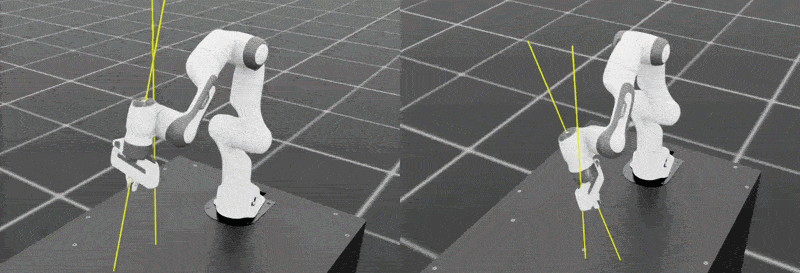
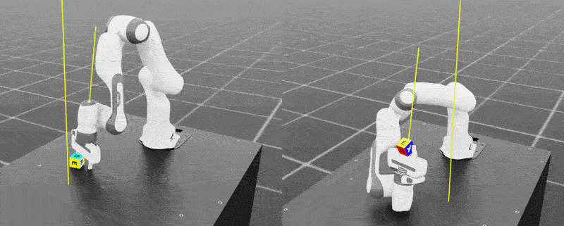

## From locomotion to interaction

In the previous [Learning Path](https://learn.arm.com/learning-paths/laptops-and-desktops/dgx_spark_isaac_robotics/), you completed the installation and basic execution of [Isaac Sim](https://developer.nvidia.com/isaac/sim) / [Isaac Lab](https://developer.nvidia.com/isaac/lab) on an Arm-based [DGX Spark](https://www.nvidia.com/en-gb/products/workstations/dgx-spark/) system. This section builds on that foundation and moves into **manipulation-focused** simulation scenarios, taking the next step beyond locomotion and into interaction with the environment.

In the earlier learning path, you successfully trained a robot to walk stably across complex terrain. However, locomotion is only the first step. To be useful in real-world settings, robots also need the ability to interact with objects and surroundings.

In this section, you will move into the world of **manipulation**. Using the [Franka 7-DOF](https://franka.de/franka-research-3) robotic arm, you will first train the basic **Reach** task, and then progress to the more advanced **Lift** task, which introduces grasping behavior.

In addition to observing simulation results, this section also highlights the value of Arm-based systems in **workflow control**. By using Python scripts and command-line tools, developers can quickly switch tasks, adjust experiment flows, and drive a GPU-backed simulation workflow on the same platform.

## Learning objectives

After completing this section, you will be able to:

* Understand the control model and coordinate concepts used for a robotic arm in Isaac Lab.
* Train your first hand-eye coordination policy with the **Reach** task.
* Run a compound manipulation task that includes grasping behavior with the **Lift** task.
* Switch between simulation tasks through scripts and command-line execution, and understand the role of the Arm CPU in workflow control.
* Compare the training characteristics of different robot platforms in Isaac Lab.


## Task 1: Reach — Building Spatial Awareness

The simplest manipulation task is to make the robot **reach** a target position. This requires the robot to understand the spatial relationship between its end-effector, the attached device at the end of the robot's arm, and a randomly sampled target point. It is not only a kinematics problem, but also the starting point for spatial awareness. 

### Scenario Goal 

Train the Franka robotic arm to move its end-effector to a randomly sampled target pose.


### Run

Follow the previous learning path installation setting, run the following commands in your terminal:

```bash
cd ~/IsaacLab

# Improve runtime compatibility on aarch64 systems
export LD_PRELOAD="$LD_PRELOAD:/lib/aarch64-linux-gnu/libgomp.so.1"

./isaaclab.sh -p scripts/reinforcement_learning/rsl_rl/train.py \
    --task=Isaac-Reach-Franka-v0 \
    --headless \
    --num_envs=2048
```

### What this script controls

This command does more than simply start training. From a workflow perspective, the Python training script controls:

* which task configuration is loaded
* which RL training entry point is used
* runtime behavior such as headless execution and the number of environments

This type of script-level control is well suited to rapid iteration on an Arm-based system, where the CPU handles tooling, task launch, and workflow control, while the GPU handles the simulation workload.

### Task structure

* **Goal**: Move the end-effector of the Franka 7-DOF arm to a randomly sampled target pose.
* **Observation space**: Joint positions, joint velocities, and target position.
* **Action space**: Joint position targets.

### Verify

After training, run the following command to observe the learned policy in simulation:

```bash
./isaaclab.sh -p scripts/reinforcement_learning/rsl_rl/play.py     --task=Isaac-Reach-Franka-Play-v0     --num_envs=2   --checkpoint=logs/rsl_rl/franka_reach/<date_of_training>/model_<iteration_number>.pt
```

{}

To view the Franka arm more clearly, right-click in the viewport and use `W`, `A`, `S`, and `D` to fly the camera around the scene. Use W and S to move closer to or farther from the table, and A and D to move left and right.

{}



You should observe the following:

* The robotic arm can consistently move its end-effector to the target position.
* Multiple environments execute the reaching behavior in parallel.
* The policy no longer shows obvious random oscillation or unstable motion.

### Why it matters on Arm

The Arm value in this example is not about claiming CPU-dominant simulation performance. Instead, it demonstrates the **Arm CPU as a control plane**: on an Arm-based development system, you can switch tasks, launch experiments, and evaluate policies directly through scripts, enabling fast iteration for robotics simulation workflows.


## Task 2: Lift — balancing force and precision

Once the robot can reliably reach a target, the next challenge is physical interaction with an object. The **Lift** task requires the robot to combine four skills into a continuous sequence: approach, align, grasp, and lift. 

### Scenario Goal 

Train the robotic arm to grasp a cube on the table and lift it to a target height.

### Run

```bash
./isaaclab.sh -p scripts/reinforcement_learning/rsl_rl/train.py \
    --task=Isaac-Lift-Cube-Franka-v0 \
    --headless \
    --num_envs=2048
```

{}

You may find that after the first training run, the end-effector is unable to lift the cube. To resume training, provide the following additional arguments from the script to resume training from a specific checkpoint

```bash
--resume \
  --experiment_name=franka_lift \
  --load_run=<time stamp of run> \
  --checkpoint=model_<iteration>.pt \
  --max_iterations=<number of additional iterations>
```

To have a rough idea of when your model may be converging on a solution, look at the `mean reward` value and see when it is no longer increasing in value. 

{}

```output
################################################################################
                          Learning iteration 902/2650                            

                            Total steps: 37011456 
                       Steps per second: 68548 
                        Collection time: 0.600s 
                          Learning time: 0.117s 
                        Mean value loss: 2.1550
                    Mean surrogate loss: -0.0023
                      Mean entropy loss: 7.1831
                            Mean reward: 79.76
                    Mean episode length: 246.64
                        Mean action std: 0.64
         Episode_Reward/reaching_object: 0.7022
          Episode_Reward/lifting_object: 11.2984
    Episode_Reward/object_goal_tracking: 5.6466
Episode_Reward/object_goal_tracking_fine_grained: 0.0891
             Episode_Reward/action_rate: -0.7642
               Episode_Reward/joint_vel: -1.4792
                 Curriculum/action_rate: -0.1000
                   Curriculum/joint_vel: -0.1000
     Metrics/object_pose/position_error: 0.2638
  Metrics/object_pose/orientation_error: 0.8218
           Episode_Termination/time_out: 0.9782
    Episode_Termination/object_dropping: 0.0218
--------------------------------------------------------------------------------
                         Iteration time: 0.72s
                           Time elapsed: 00:09:59
                                    ETA: 00:23:11
```


### What changes in the workflow

Compared with Reach, you do not need to rebuild the project or move to another platform. You only switch the task to enter a new simulation scenario. This is the value of workflow control: with the same Python entry point and the same development environment, you can quickly move across different task logics and training configurations.

In the Lift task, the agent must learn how to close the gripper around the cube and lift it to the target height. This means the policy must coordinate approach, grasping, and stable lifting, while beginning to account for gravity and contact behavior.

### Verify

After training, confirm the following:

* The robotic arm can approach the cube and adjust its gripper position.
* The gripper closes at an appropriate time.
* The cube is lifted off the table rather than slipping away or bouncing after collision.


You can use the same way to verify the result.

```bash
./isaaclab.sh -p scripts/reinforcement_learning/rsl_rl/play.py \
    --task=Isaac-Lift-Cube-Franka-v0 \
    --num_envs=2
    --checkpoint=<path to model*.pt file>
```




### Why it matters on Arm

This type of task switch highlights the practical value of Arm-based systems for robotics development. The CPU side handles scripts, tools, and experiment orchestration, allowing developers to move quickly between simulation workflows on the same platform while continuing to use the GPU for high-load simulation.


## Extended exploration: comparing different locomotion robots

Before moving deeper into more complex manipulation tasks, Isaac Lab also provides a wide range of locomotion environments that let you compare the training characteristics of different robot types.

| Environment | Robot | Type | Terrain | Difficulty |
|---|---|---|---|---|
| Isaac-Velocity-Flat-Unitree-Go2-v0 | Unitree Go2 | Quadruped | Flat | Easy |
| Isaac-Velocity-Rough-H1-v0 | Unitree H1 | Biped humanoid | Rough | Hard |
| Isaac-Velocity-Flat-Spot-v0 | BD Spot | Quadruped | Flat | Easy |
| Isaac-Velocity-Flat-Digit-v0 | Agility Digit | Biped humanoid | Flat | Hard |

{}
Quadrupeds such as Go2 and Spot are naturally more statically stable, so their policies often converge faster than those of biped humanoids, which must maintain dynamic balance throughout training.
{}

The point of this comparison is not only to see which robot is easier to train, but also to understand how the same development platform and the same script entry point can be used to switch quickly across simulation workflows for scenario and task exploration.


## Wrap-up

In this section, you completed the first manipulation steps in Isaac Lab:

* Used the **Reach** task to build spatial awareness for the end-effector
* Used the **Lift** task to introduce contact and grasping behavior
* Switched between simulation scenarios through the command line and Python training scripts
* Understood that, in this workflow, the Arm CPU mainly serves as the control plane for development iteration

## Next up

The Franka robotic arm now has basic grasping ability. However, objects in the real world often introduce more complex mechanical constraints.

In the next section, you will explore how a robot can interact with joint-constrained objects such as drawers, and move one step closer to high-precision industrial manipulation tasks.
