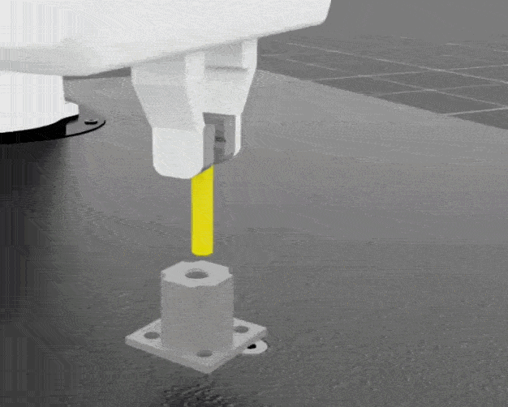

In the previous section, you trained the Franka arm on the basic Reach and Lift tasks. This section continues the same Arm-based Isaac Sim / Isaac Lab workflow and moves into **contact-rich manipulation**: interacting with objects that include mechanical constraints, contact forces, and high precision requirements.

In real industrial environments, a robot does more than pick up free objects. Drawers move along rails, pegs must be inserted into tight sockets, and nuts must align with bolts before threading can begin. These tasks require a policy to understand **contact**, **constrained motion**, and **failure modes caused by small errors**.

This section starts with the **Open-Drawer** task to introduce interaction with articulated objects, and then moves into Isaac Lab's **Factory** environments, where you explore higher-precision industrial assembly workflows.

## Task 1: Open-Drawer

In this task, you train the Franka arm to reach the drawer handle, grasp it, and pull the drawer open along its rail. Unlike the Lift task from the previous section, a drawer is an articulated object: it is made of linked parts connected by a joint, so it can move only along a defined path (the rail) instead of moving freely in any direction. The policy must handle stable contact, constrained motion, and contact forces throughout the interaction.

### Run

Run the training script in the `rsl_rl` with the following command. This uses the proximal policy optimization (PPO) algorithm. 

```bash
./isaaclab.sh -p scripts/reinforcement_learning/rsl_rl/train.py \
    --task=Isaac-Open-Drawer-Franka-v0 \
    --headless \
    --num_envs=2048
```

{}

You may notice the time to draw these tasks with a greater number of possible actor actions is increasing. If you want to run the model from a pre-trained checkpoint, you can trying passing in the `--use_pretrained_checkpoint` argument to the `play.py` script. Please note that there may not be a model available from NVIDIAs Omniverse for your specific task and `IsaacLab` tag. 

{}

### What makes this task harder

The Open-Drawer task is more complex than Reach and Lift because the policy must handle multiple challenges simultaneously: stable contact between the gripper and the handle, constrained motion imposed by the drawer rail, and friction or collision errors during pulling. Unlike pure reaching, the robot must establish contact and then maintain correct interaction throughout the motion. This requires the policy to understand both position control and force feedback.

### Verify

After training, confirm the following:

* The robotic arm approaches and aligns with the handle instead of stopping in front of the drawer.
* Once contact is established, the drawer moves along the rail direction.
* The opening motion remains stable without slipping, shaking, or applying force in the wrong direction.

To view the trained policy, replace the checkpoint path with your model `.pt` file in the log directory:

```bash
./isaaclab.sh -p scripts/reinforcement_learning/rsl_rl/play.py \
    --task=Isaac-Open-Drawer-Franka-v0 \
    --num_envs=1 \
    --checkpoint=<path_to_your_model.pt>
```


## Task 2: Factory environments — moving toward sub-millimeter precision

To support industrial automation scenarios, Isaac Lab provides the **Factory** family of environments. In this task, you will explore high-precision assembly tasks such as peg insertion, which require sub-millimeter contact control and careful force feedback. These tasks emphasize high-fidelity contact simulation and show how precision assembly differs from general manipulation. The Factory environments use the same PPO algorithm as earlier tasks, but with hyperparameters tuned for precision control in the `rl_games` training library instead of `rsl_rl`.

### Run

Factory tasks use the `rl_games` training library instead of `rsl_rl`. This means you switch both the task and the training workflow entry point quickly, demonstrating how Python scripts enable quick experimentation:

```bash
./isaaclab.sh -p scripts/reinforcement_learning/rl_games/train.py \
    --task=Isaac-Factory-PegInsert-Direct-v0 \
    --headless
```

Training runs for the default number of epochs specified in `/source/isaaclab_tasks/isaaclab_tasks/direct/factory/agents/rl_games_ppo_cfg.yaml` under `max_epochs`. During training, you'll see output like:

```output
fps step: 416 fps step and policy inference: 409 fps total: 337 epoch: 32/200 frames: 507904
fps step: 408 fps step and policy inference: 401 fps total: 332 epoch: 33/200 frames: 524288
saving next best rewards:  [300.05377]
=> saving checkpoint '/home/kieran/IsaacLab/logs/rl_games/Factory/test/nn/Factory.pth'
```

In this output:

* **fps step**: Simulation speed (steps per second) without inference.
* **fps ... policy inference**: Speed including policy execution overhead.
* **fps total**: Overall throughput including collection and learning.
* **frames**: Cumulative transitions (state, action, reward tuples) experienced across all parallel environments. A frame represents one timestep in one environment instance, so higher frame counts mean more data for learning.

To view a trained policy in simulation, replace the checkpoint path with your log directory. We are also adding environment to minimize the time it takes to observe the peg insertion.

```bash
./isaaclab.sh -p scripts/reinforcement_learning/rl_games/play.py \
  --task=Isaac-Factory-PegInsert-Direct-v0 \
  --checkpoint=<path_to_your_factory_model.pth> \
  --num_envs=1 \
  --real-time \
  --seed=-1 \
  env.episode_length_s=4.0 \
  env.task.fixed_asset_init_pos_noise=[0.08,0.08,0.02] \
  env.task.hand_init_pos_noise=[0.03,0.03,0.02]
```




### What changes in the workflow

You switched both the task and the training library. Using Python scripts to control task selection and training entry points lets you experiment with different algorithms and environments without recompilation. This rapid iteration capability is valuable on any platform, but especially on Arm-based systems where the CPU handles orchestration while the GPU runs simulation.

### Why these tasks matter

Factory tasks are common in industrial automation and assembly scenarios. They are challenging because:

* alignment tolerances are very small
* physical feedback after contact is highly sensitive
* position, orientation, and force control become tightly coupled

For example, peg insertion requires stable alignment before insertion, while nut threading adds even more demanding pose control and rotational behavior. These tasks are usually much more sensitive to small errors than Reach, Lift, or drawer interaction.

{}
For Factory tasks, high-fidelity contact-force simulation is essential. Whether the agent can respond to sub-millimeter physical feedback directly affects the success rate of insertion, threading, and assembly tasks.
{}

## Comparing manipulation task depth

As tasks evolve from simple reaching to precision assembly, the technical demands increase significantly.

| Environment | Task | Difficulty | Key challenge |
|---|---|---|---|
| Isaac-Reach-Franka-v0 | Reach a target pose | Easy | Learn basic inverse control through RL |
| Isaac-Open-Drawer-Franka-v0 | Open a drawer | Medium | Contact-rich manipulation with mechanical constraints |
| Isaac-Factory-NutThread-Direct-v0 | Thread a nut onto a bolt | Hard | Precise torque and pose control |

This comparison also helps show that not all manipulation tasks are simple object relocation problems. Once a workflow includes articulated object interaction and industrial assembly, the importance of contact stability, precision, and experiment control rises quickly.


## Next up

A single robotic arm can already complete more precise interactions, but more complex automation scenarios often require multiple agents working together.

In the next section, you will move beyond single-robot operation and explore how multiple robotic agents can cooperate to complete a task.